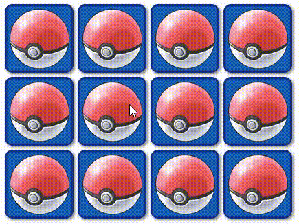

# JS-Games
This repository holds the source code of a collection of simple JavaScript games that will be available at [my website](https://pablodavila.eu).

### Tetris
A reimplementation of this classic game built with HTML elements.

### PokeMemory
A memory game with a Pokémon theme! This game makes use of the [PokeAPI](https://pokeapi.co/) to fetch random Pokémon sprites.

## Contributing
Improvements and game additions are welcome!
